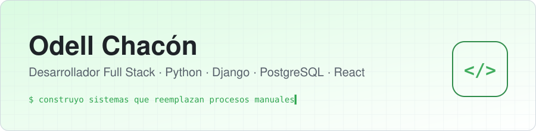
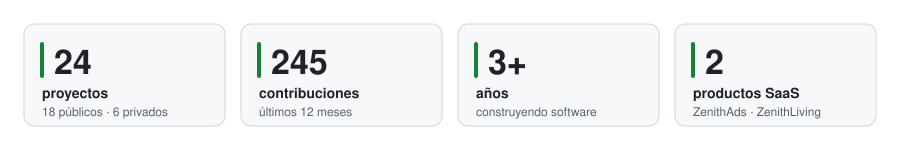
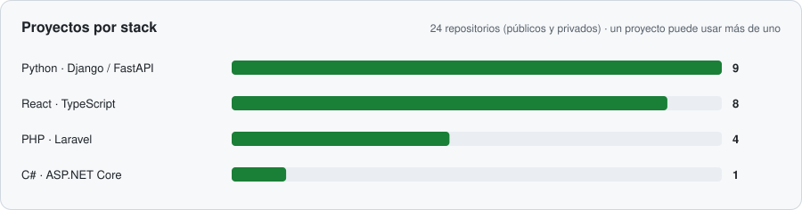

<picture>
  <source media="(prefers-color-scheme: dark)" srcset="./assets/header-dark.svg">
  
</picture>

  
  
  
  

Construyo sistemas web de gestión de punta a punta: levanto el requerimiento, modelo los datos, desarrollo backend y frontend, y lo dejo desplegado. Me gusta el trabajo donde hay un proceso que hoy se lleva en papel o en Excel y hay que convertirlo en un sistema que la gente use todos los días.

📍 Valencia, Venezuela · 🏢 GrupoZenith · 🌎 Abierto a trabajo remoto

<picture>
  <source media="(prefers-color-scheme: dark)" srcset="./assets/stats-dark.svg">
  
</picture>

---

## 🚀 Proyectos destacados

<table>
<tr>
<td width="50%" valign="top">

### ⚙️ [Workflow Engine](https://github.com/OdellChacon/workflow-engine)
Motor de automatización tipo n8n. Flujos `trigger → condición → acción` ejecutados en una cola sobre PostgreSQL con reintentos, backoff exponencial, dead-lettering e idempotencia.

- Workers concurrentes con `FOR UPDATE SKIP LOCKED`
- Intérprete de expresiones propio, sin `eval`
- Secretos cifrados con Fernet · deploy en Render

`Django` `PostgreSQL` `HTMX` `Render`

</td>
<td width="50%" valign="top">

### ⛽ [Fuel Track](https://github.com/OdellChacon/FUELTRACK)
**Telefónica Venezolana.** Control de consumo de combustible de los motogeneradores en las estaciones de telecomunicaciones de la región andina. Reemplazó el registro en planillas manuales.

- Modelo de datos para cargas por estación y consumo
- Módulo de auditoría y vistas para el personal operativo

`Django` `PostgreSQL` `TailwindCSS`

</td>
</tr>
<tr>
<td width="50%" valign="top">

### 🏨 [PMS Hotelería](https://github.com/OdellChacon/PMS_HOTELERIA)
Sistema de gestión hotelera: reservas, habitaciones, huéspedes, eventos, restaurante e inventario, con panel de reportes para la administración.

`Django` `JavaScript` `SQLite`

</td>
<td width="50%" valign="top">

### 🎓 [Sistema SARA](https://github.com/OdellChacon/SISTEMA_SARA)
**UPTAIET.** Asistencia docente, horarios y asignación de aulas. Automatizó una planificación que se armaba a mano cada período.

`Django` `PostgreSQL` `TailwindCSS`

</td>
</tr>
</table>

**Landings para clientes:** [Natural Rosse](https://natural-rosse.vercel.app) ([código](https://github.com/OdellChacon/Natural-Rosse)) · [Drexsi](https://github.com/OdellChacon/Milvus-Drexsi-Millenium) · [NutriFuerza](https://github.com/OdellChacon/Milvus-Nutrifuerza-Millenium) — `React` `TypeScript` `Tailwind` `Framer Motion`

## 🔒 En desarrollo (repositorios privados)

| Proyecto | Qué es | Stack |
|---|---|---|
| **GrupoZenith - Sitio web corporativo** | Landing de la empresa, panel interno para el staff y panel para clientes con el avance de sus proyectos. Desarrollado por mí en solitario | Django · DRF · PostgreSQL · React 19 · TypeScript · Vite |
| **ZenithAds** | SaaS multi-tenant para agencias de marketing: aprobación de piezas vía WhatsApp, calendario editorial, CRM y conector de Ads & BI | Django · DRF · React 19 · TypeScript · IA |
| **ZenithLiving** | SaaS de administración de condominios en Venezuela: cobranza multimoneda con tasa BCV, pagos combinados, asambleas y contabilidad | NestJS · Next.js · PostgreSQL |
| **Visualizador de cerámicas con IA** | Plataforma web + app móvil para un distribuidor de cerámicas: el cliente sube una foto y ve pisos y paredes con el producto aplicado en perspectiva. En producción | Python · FastAPI · visión por computadora · Celery · Docker |
| **Sitios para clientes** | Tiendas y landings de productos para negocios locales | React · TypeScript · Tailwind |

El código es privado por acuerdos con clientes o por ser producto comercial. Puedo mostrar demos o detalles técnicos en una entrevista.

---

## 🛠️ Stack

  
  
  
  
  
  
  
  
  
  
  
  
  
  
  
  

<picture>
  <source media="(prefers-color-scheme: dark)" srcset="./assets/stack-dark.svg">
  
</picture>

## 💼 Experiencia

| Rol | Empresa | Periodo |
|---|---|---|
| Jefe de Laboratorio de Informática | UPTAIET | 2025 – 2026 |
| Desarrollador Full Stack (pasantía) | Telefónica Venezolana | 2025 |
| Analista de Soporte y Desarrollo | DTODO Tech Innovations · Costa Rica (remoto) | 2023 – 2024 |

## 🎓 Formación

- **Ingeniería de Sistemas** — Universidad Politécnica Santiago Mariño
- **Ingeniería en Informática** — UPTAIET
